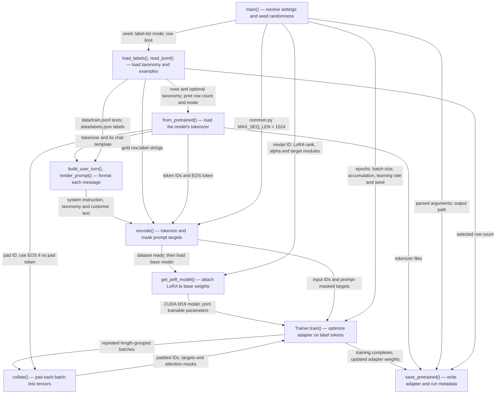

Path: `repo/train.py:main()` via `python train.py` with defaults, from loading training inputs through saving the LoRA adapter.

| box id | label | where it lives (file:function or file:line range) | what it does |
|---|---|---|---|
| A | main() — resolve settings and seed randomness | repo/train.py:96–111; repo/train.py:40–43; repo/common.py:16–34 | Resolves CLI options. Model defaults to `BASE_MODEL` environment variable or `nvidia/Llama-3.1-Nemotron-Nano-4B-v1.1`; `--model` overrides it. Defaults: all rows, 2 epochs, batch 32, accumulation 1, learning rate 0.0001, LoRA rank 16/alpha 32, seed 13, taxonomy included. Seeds randomness; paths are relative to `common.py`, with output in `repo/out/adapter`. |
| B | load_labels(), read_jsonl() — load taxonomy and examples | repo/common.py:load_labels; repo/train.py:read_jsonl; repo/train.py:112–116 | Reads `repo/data/labels.json` unless `--no-label-list`; reads every nonblank JSON line from `repo/data/train.jsonl`, using its `text` and `label`. A nonzero `--limit` slices the rows in file order. Prints selected row count and whether the prompt includes labels. |
| C | from_pretrained() — load the model's tokenizer | repo/train.py:118–120 | Loads tokenizer assets for the resolved model from the library's cache or model source. Its vocabulary, EOS token and chat template shape the training sequences and saved tokenizer. Falls back to EOS for padding. |
| D | build_user_turn(), render_prompt() — format each message | repo/common.py:build_user_turn; repo/common.py:render_prompt; repo/train.py:55 | Combines the fixed classification instruction, optional ordered taxonomy and row text; adds system message `detailed thinking off`. Applies the loaded tokenizer's chat template with a generation prompt. |
| E | encode() — tokenize and mask prompt targets | repo/train.py:encode; repo/train.py:122 | Appends the gold label plus EOS, tokenizes without extra special tokens, and marks prompt targets `-100` so only answer tokens contribute to loss. Left-trims overlong sequences to 1024 tokens and shifts the mask boundary. Prints a warning with the truncated-example count if any sequences exceed the limit. |
| F | get_peft_model() — attach LoRA to base weights | repo/train.py:124–140; repo/train.py:40–43 | Loads pretrained weights/configuration for the same model ID in bf16 on CUDA; disables the model cache. Adds causal-LM LoRA with CLI rank/alpha, dropout 0.05, no bias, and targets `q_proj`, `k_proj`, `v_proj`, `o_proj`, `gate_proj`, `up_proj`, `down_proj`. Prints trainable-parameter statistics. |
| G | collate() — pad each batch into tensors | repo/train.py:collate; repo/train.py:164 | Right-pads input IDs to the longest sequence in each batch using the tokenizer's pad ID; pads targets with `-100`. Produces tensors and an attention mask that excludes padding. Called repeatedly by the Trainer data loader. |
| H | Trainer.train() — optimize adapter on label tokens | repo/train.py:142–166 | Combines model, encoded examples and collator. Uses CLI training settings, cosine learning-rate scheduling, 3% warmup, bf16/tf32, length grouping, four loader workers and pinned memory. Library training logs use `logging_steps=10`; reporting integrations are disabled. The configured directory is `repo/out/checkpoints`, but `save_strategy="no"` disables periodic checkpoint saves. |
| I | save_pretrained() — write adapter and run metadata | repo/train.py:168–177 | Saves trained LoRA adapter weights/configuration and tokenizer assets to `repo/out/adapter`. Writes `train_config.json` containing parsed arguments plus selected `n_rows`; this metadata does not snapshot the data, prompt constants or all fixed training settings. Prints the adapter path and the suggestion to run `evaluate.py`. |

## Other entry points

- Direct `python train.py` variants: CLI overrides change model, row selection, training settings and seed; `--no-label-list` skips taxonomy loading and omits it from prompts. The documented smoke path is `python train.py --limit 200 --epochs 1` (`repo/train.py:7–8`).
- Container default: `repo/Dockerfile:15` runs `python train.py` from `/app`, with copied code/data and `HF_HOME=/cache/hf` (`repo/Dockerfile:3–13`).
- Kubernetes path: `sudo k3s kubectl apply -f training.yaml` launches the container command `python train.py --batch-size 32 --grad-accum 1 --limit 2000 --epochs 1`; on success the shell prints `TRAIN_DONE` and sleeps indefinitely (`repo/training.yaml:23–32`). Build, push, log viewing, output copying and cleanup commands are documented in `repo/README.md:6–20`.
- `evaluate.py` is referenced in comments and the final console message, but that file is absent from this repository; no runnable evaluation path is provided.
