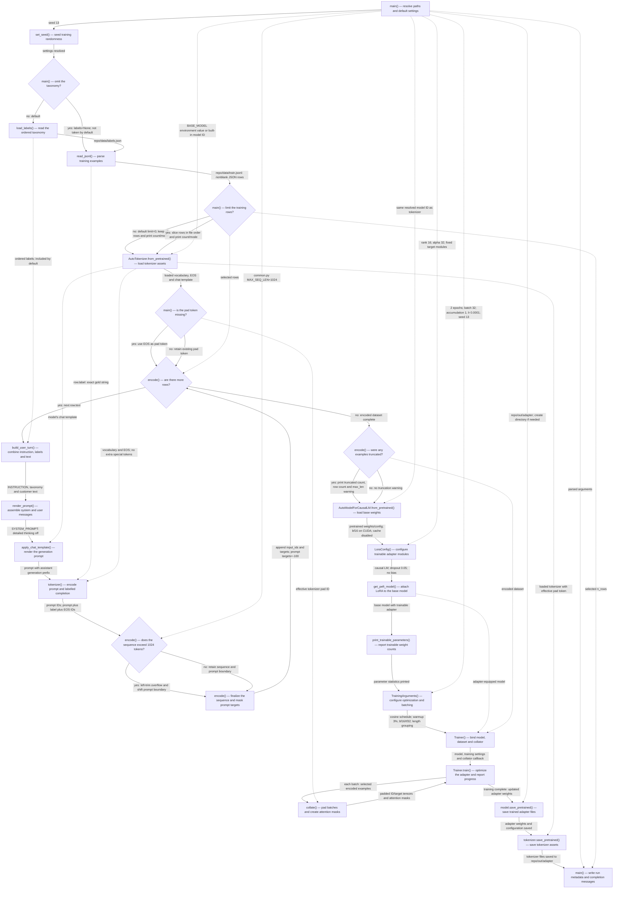

Path: `repo/train.py:main()` via `python train.py` with defaults, from loading training inputs through saving the LoRA adapter.

| box id | label | where it lives (file:function or file:line range) | what it does |
|---|---|---|---|
| A | main() — resolve paths and default settings | repo/train.py:96–109; repo/train.py:40–43; repo/common.py:16–34 | Parses defaults: all rows, 2 epochs, batch 32, accumulation 1, learning rate 0.0001, LoRA rank 16/alpha 32, seed 13, taxonomy enabled. Model comes from `BASE_MODEL` environment variable or `nvidia/Llama-3.1-Nemotron-Nano-4B-v1.1`. Paths are relative to `common.py`; sequence limit is 1024. Dotted edges throughout the diagram carry dependencies; solid edges show execution and callback flow. |
| B | set_seed() — seed training randomness | repo/train.py:111 | Calls the imported Transformers seed function with 13; the seed also enters training arguments. Library implementation is outside the repository. |
| C | main() — omit the taxonomy? | repo/train.py:112 | Defaults to calling `load_labels()`. With `--no-label-list`, skips the file and passes `None` through prompt construction. |
| D | load_labels() — read the ordered taxonomy | repo/common.py:37–38 | Parses `repo/data/labels.json` as JSON. Its ordered strings become the taxonomy in every default prompt. |
| E | read_jsonl() — parse training examples | repo/train.py:46–48; repo/train.py:113 | Reads `repo/data/train.jsonl` in file order, ignoring blank lines and parsing each remaining line. `text` supplies the customer message; `label` supplies the exact answer string. No normalization runs on this path. |
| F | main() — limit the training rows? | repo/train.py:114–116 | Default `limit=0` retains every row; a nonzero limit slices the list. Prints the resulting row count and whether labels are present; the same count is later saved as `n_rows`. |
| G | AutoTokenizer.from_pretrained() — load tokenizer assets | repo/train.py:118 | Loads tokenizer assets for the resolved model through Transformers, potentially from its cache or model source. Vocabulary, EOS and chat template affect all encoded examples and the saved tokenizer. Exact external asset files are not specified in this repository. |
| H | main() — is the pad token missing? | repo/train.py:119–120 | If no pad ID exists, assigns EOS as the pad token; otherwise keeps the existing pad token. The outcome feeds batch padding and tokenizer persistence. Which branch runs depends on the loaded tokenizer. |
| I | encode() — are there more rows? | repo/train.py:51–55; repo/train.py:78; repo/train.py:122 | Initializes the dataset and truncation counter, processes each selected row, then returns the encoded list after the truncation check. |
| J | build_user_turn() — combine instruction, labels and text | repo/common.py:29–32; repo/common.py:41–47; repo/train.py:55 | Formats the fixed instruction to return exactly one intent label, the ordered taxonomy when nonempty, and the quoted customer text. The default taxonomy is nonempty, so the label-list branch is taken. |
| K | render_prompt() — assemble system and user messages | repo/common.py:27; repo/common.py:50–55; repo/train.py:55 | Pairs system content `detailed thinking off` with the formatted user message. |
| L | apply_chat_template() — render the generation prompt | repo/common.py:56–58 | Calls the loaded tokenizer's template with `tokenize=False` and `add_generation_prompt=True`. Its rendered text determines the prompt prefix. Library implementation is outside the repository. |
| M | tokenizer() — encode prompt and labelled completion | repo/train.py:56–61 | Forms completion from the row's gold label plus tokenizer EOS. Tokenizes the prompt alone and the concatenated prompt/completion with `add_special_tokens=False`; prompt-only length defines the masking boundary. |
| N | encode() — does the sequence exceed 1024 tokens? | repo/train.py:62–70; repo/common.py:34 | Compares full sequence length against `MAX_SEQ_LEN`. If overlong, removes overflow tokens from the left, reduces the prompt boundary with a floor of zero, and increments the truncation count. Both outcomes depend on row text, taxonomy, template, gold label and tokenizer. |
| O | encode() — finalize the sequence and mask prompt targets | repo/train.py:61–73 | Stores the retained IDs and targets. Prompt positions receive `-100`; positions from the adjusted boundary onward keep their token IDs, so answer tokens supply the training loss. |
| P | encode() — were any examples truncated? | repo/train.py:75–78 | Prints a warning only when the truncation count is nonzero, including that count, total selected rows and maximum length; then returns the dataset. |
| Q | AutoModelForCausalLM.from_pretrained() — load base weights | repo/train.py:124–127 | Loads the same resolved model's pretrained weights and configuration in bf16 with CUDA placement, then disables model cache. The external base weights shape adapter learning; exact loaded files are delegated to Transformers. |
| R | LoraConfig() — configure trainable adapter modules | repo/train.py:40–43; repo/train.py:128–135 | Sets rank 16, alpha 32, dropout 0.05, no bias, and causal-LM task type. Targets `q_proj`, `k_proj`, `v_proj`, `o_proj`, `gate_proj`, `up_proj`, `down_proj`. These settings enter the saved adapter configuration. |
| S | get_peft_model() — attach LoRA to the base model | repo/train.py:136–139 | Calls PEFT with the loaded model and LoRA configuration to produce the adapter-equipped training model. Library implementation is outside the repository. |
| T | print_trainable_parameters() — report trainable weight counts | repo/train.py:140 | Prints trainable-parameter statistics from the adapter-equipped model; model structure and LoRA configuration determine the counts. |
| U | TrainingArguments() — configure optimization and batching | repo/train.py:144–162 | Combines parsed hyperparameters with cosine scheduling, 3% warmup, bf16/tf32, length grouping, four loader workers and pinned memory. Logs every 10 steps, disables reporting integrations, and sets `repo/out/checkpoints` as output directory with periodic saves disabled by `save_strategy="no"`. |
| V | Trainer() — bind model, dataset and collator | repo/train.py:142–165 | Binds model, training arguments and encoded dataset. The callback passes the tokenizer's effective pad ID to `collate()` for each batch. |
| W | Trainer.train() — optimize the adapter and report progress | repo/train.py:166 | Runs library training with the bound dependencies, repeatedly requesting padded batches and updating trainable adapter weights. Training progress/logs arise from these data and settings; optimizer and other unspecified defaults belong to the installed library. No evaluation dataset or evaluation call appears on this path. |
| X | collate() — pad batches and create attention masks | repo/train.py:81–93; repo/train.py:164 | Right-pads each batch to its longest sequence. Inputs use the effective pad ID, targets use `-100`, and attention masks mark actual tokens with 1 and padding with 0. Returns tensors to training. |
| Y | model.save_pretrained() — save trained adapter files | repo/train.py:168–169; repo/common.py:22 | Creates `repo/out/adapter` if needed and calls PEFT model persistence there. Saves adapter weights/configuration shaped by base weights, encoded examples, initialization, LoRA settings and training. Exact filenames are delegated to the installed library. |
| Z | tokenizer.save_pretrained() — save tokenizer assets | repo/train.py:170; repo/common.py:22 | Saves the loaded tokenizer, including the effective padding configuration, alongside the adapter in `repo/out/adapter`. Exact filenames are delegated to Transformers. |
| AA | main() — write run metadata and completion messages | repo/train.py:171–177 | Writes `repo/out/adapter/train_config.json` from parsed arguments plus selected `n_rows`, then prints the adapter path and `next: python evaluate.py`. Metadata does not snapshot input files, prompt constants or all fixed training settings; the final message does not execute evaluation. |
