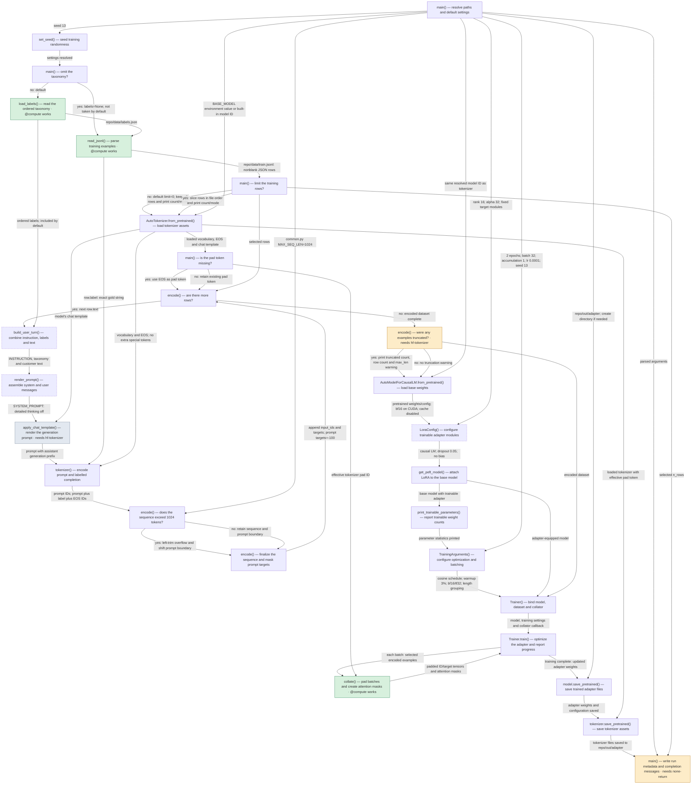

# CFG + data flow

*5 functions boxed, 5 computations, 4 components; 1 hand-off unknown, 1 cross-check to review.*

Path (from L1): `repo/train.py:main()` via `python train.py` with defaults, from loading training inputs through saving the LoRA adapter.

Types: the catalogue only (--types ast). Nothing was run.

## Annotated L2 diagram

Solid arrows are the CFG's own. Dashed arrows are hand-offs the data-flow report found that the CFG did not draw. Box colours: amber = a bare `@compute` raises here (the recipe is named), green = it works, grey = a loop body, not a node; dashed border = the box names no function the entry reaches.

## Boxes joined to functions

| box | label | function | data flow |
|---|---|---|---|
| A | main() — resolve paths and default settings | `main` (inside) | see box AA |
| B | set_seed() — seed training randomness | `main` (inside) | see box AA |
| C | main() — omit the taxonomy? | `main` (inside) | see box AA |
| D | load_labels() — read the ordered taxonomy | `load_labels` | — |
| E | read_jsonl() — parse training examples | `read_jsonl` | — |
| F | main() — limit the training rows? | `main` (inside) | see box AA |
| G | AutoTokenizer.from_pretrained() — load tokenizer assets | `main` (inside) | see box AA |
| H | main() — is the pad token missing? | `main` (inside) | see box AA |
| I | encode() — are there more rows? | `encode` (inside) | see box P |
| J | build_user_turn() — combine instruction, labels and text | — | common.py:29 is at module level |
| K | render_prompt() — assemble system and user messages | — | common.py:27 is at module level |
| L | apply_chat_template() — render the generation prompt | `render_prompt` (inside) | loop body; bare @compute raises; needs hf-tokenizer |
| M | tokenizer() — encode prompt and labelled completion | `encode` (inside) | see box P |
| N | encode() — does the sequence exceed 1024 tokens? | `encode` (inside) | see box P |
| O | encode() — finalize the sequence and mask prompt targets | `encode` (inside) | see box P |
| P | encode() — were any examples truncated? | `encode` (inside) | bare @compute raises; needs hf-tokenizer; receives, made inline by its caller: tokenizer: transformers.PreTrainedTokenizerBase |
| Q | AutoModelForCausalLM.from_pretrained() — load base weights | `main` (inside) | see box AA |
| R | LoraConfig() — configure trainable adapter modules | — | train.py:40 is at module level |
| S | get_peft_model() — attach LoRA to the base model | `main` (inside) | see box AA |
| T | print_trainable_parameters() — report trainable weight count | `main` (inside) | see box AA |
| U | TrainingArguments() — configure optimization and batching | `main` (inside) | see box AA |
| V | Trainer() — bind model, dataset and collator | `main` (inside) | see box AA |
| W | Trainer.train() — optimize the adapter and report progress | `main` (inside) | see box AA |
| X | collate() — pad batches and create attention masks | `collate` | — |
| Y | model.save_pretrained() — save trained adapter files | `main` (inside) | see box AA |
| Z | tokenizer.save_pretrained() — save tokenizer assets | `main` (inside) | see box AA |
| AA | main() — write run metadata and completion messages | `main` (inside) | bare @compute raises; needs none-return |

## Cross-checks

- **tokenizer is made inline in `main`** and handed to `encode`: no function of its own produces it, so it is recorded only where a receiving node records it (CFG boxes A, B, C, F, G, H, Q, S, T, U, V, W, Y, Z inside `main`).
- **Unknown to the source pass:** common.ADAPTER_DIR.mkdir, torch.tensor, transformers.set_seed. Facts that rest on these are assumptions.
- **Unknown:** build_user_turn → render_prompt (type unknown from the source). Auto assumes the recipe that doesn't depend on it; HITL may ask.

## Not part of this run

- Box J is module-level code, the entry block: SDK start-up and export go here, not a node.
- Box K is module-level code, the entry block: SDK start-up and export go here, not a node.
- Box R is module-level code, the entry block: SDK start-up and export go here, not a node.

## Prediction

- **Every box** (before step 3's filter; auto's selection is this minus what `mode2ideas.md` drops, and `--pick` gives its numbers): 5 functions, 5 computations counting call sites, 4 component(s) with builders at every ✗: read_jsonl, encode | load_labels | collate | main
